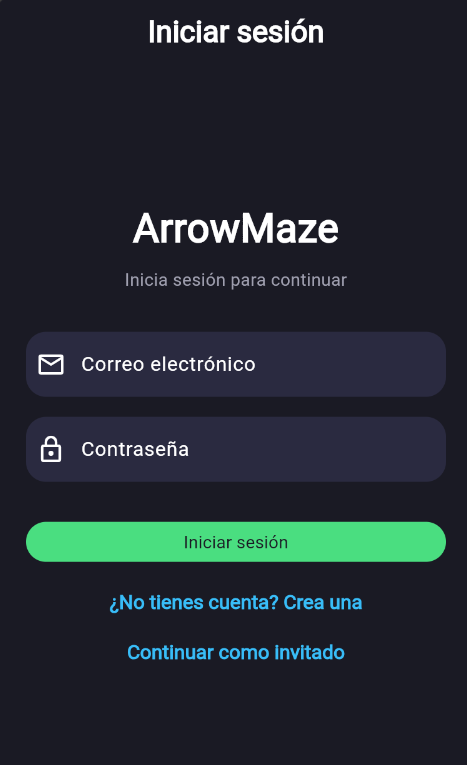
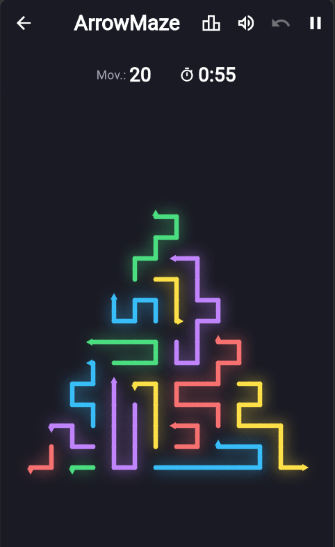
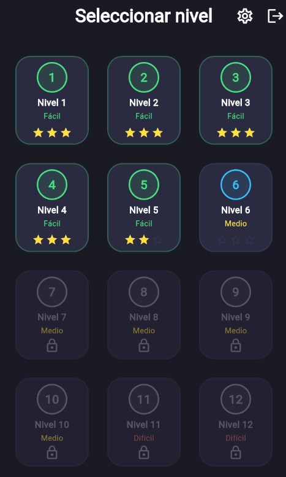
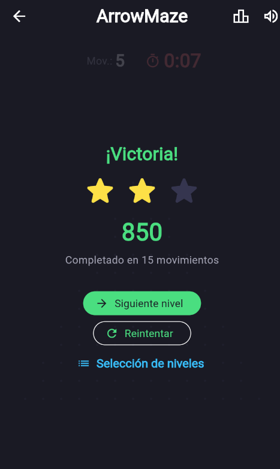
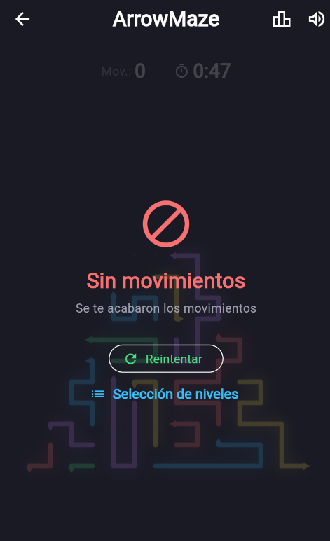
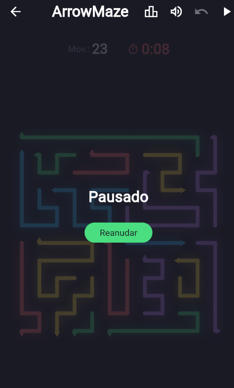
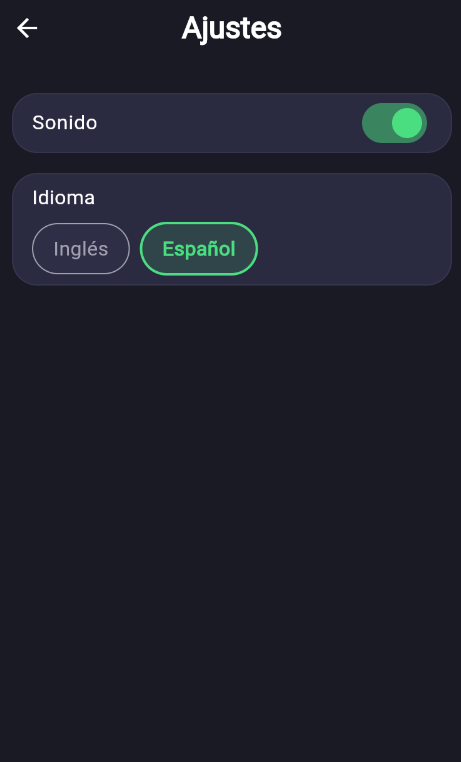

# ArrowMaze Frontend

[]()
[]()
[]()
[](LICENSE)
[]()

Flutter game inspired in the game **Arrow Maze — Escape Puzzle** (SayGames Ltd.).


**Gameplay:** the player taps cells containing arrows; a arrow traces the full
arrow chain until it hits a wall or reaches an empty destination. The goal is
to clear the board using as few moves as possible.


University project in **Desarrollo de Software** course. **NRC 25783**.
Teacher: Carlos Alonzo

## Development TEAM 01

| Member | CI Number |
|---|---|
| Blanco, Antonio | 20.613.680 |
| Márquez,Jac José | 29.710.631 |
| Fes, Mariana | 30.751.220 |

---

## Theoretical Foundation

The project architecture is grounded in the official
**[Flutter App Architecture Guide](https://docs.flutter.dev/app-architecture/guide)**
and the principles of **Clean Architecture** (Robert C. Martin).

### MVVM + Clean Architecture — 4 Layers

The project separates concerns into four layers with a strict Dependency Rule:
inner layers never import outer layers. `domain/` and `application/` are pure
Dart — **zero Flutter imports**.

| Layer | Directory | Responsibility |
|---|---|---|
| **UI Layer** | `presentation/` | Views (pure widgets, no business logic) + ViewModels (logic, state, commands via `ChangeNotifier`). 1:1 View ↔ ViewModel relationship. |
| **Application Layer** | `application/` | Use cases (interactors), cross-cutting decorators, generation strategies. Depends only on domain interfaces. |
| **Domain Layer** | `domain/` | Entities, value objects, ports (abstract interfaces), session (GoF State). Pure core with no external dependencies. |
| **Data Layer** | `infrastructure/` | Concrete implementations: HTTP, local persistence, audio, haptics. Implement the ports defined in `domain/`. |

**Composition root:** `lib/di/inyeccion.dart` — single point where all
dependencies are instantiated and wired together. Equivalent to a manual DI
container.

### 8 Implemented GoF Design Patterns

| Pattern | Location | Code | Role |
|---|---|---|---|
| **Factory Method** | `domain/entities/` | [`FabricaCeldasEstandar`](lib/domain/entities/fabrica_celdas_estandar.dart) | Creates cells and arrow paths from JSON definitions |
| **State** | `domain/sesion/` | [`EstadoSesion`](lib/domain/sesion/estado_sesion.dart) + [`SesionJuego`](lib/domain/sesion/sesion_juego.dart) | 4 sealed states: Playing, Paused, Victory, Defeat |
| **Command** | `application/use_cases/` | [`PlayerMoveCommand` + `CommandHistory`](lib/application/use_cases/command_history.dart) | Encapsulates each tap; enables undo |
| **Observer** | `domain/` | [`PublicadorEventosJuego`](lib/domain/publicador_eventos_juego.dart) + [`ObservadorJuego`](lib/domain/observador_juego.dart) | Decouples audio/UI rules from game logic |
| **Strategy** | `domain/puntuacion/`, `application/generadores/` | [`EstrategiaPuntuacion`](lib/domain/puntuacion/estrategia_puntuacion.dart), [`GeneradorNivelBase`](lib/application/generadores/generador_nivel_base.dart) | Scoring (mixed/move-based) + level generation (random/file) |
| **Singleton** | `infrastructure/audio/` | [`AudioServiceImp.instance`](lib/infrastructure/audio/audio_service_imp.dart) | Single audio service instance |
| **Decorator** | `application/decoradores/` | [`DecoradorCasoDeUso`](lib/application/decoradores/decorador_caso_de_uso.dart) + 3 decorators | Security → Logging → Metrics stack around any use case |
| **Template Method** | `application/generadores/` | [`GeneradorNivelBase`](lib/application/generadores/generador_nivel_base.dart) | Generation skeleton with mandatory `validarSolvencia()` step |

### Key Principles

- **Separation of Concerns**: Views never call use cases directly — everything goes through the ViewModel.
- **Dependency Inversion (DIP)**: `domain/` defines ports (interfaces); `infrastructure/` implements them. Higher layers depend on abstractions, not concretions.
- **Single Composition Root**: the entire object graph is assembled in `Inyeccion`.

---

## SOLID Principles

### Single Responsibility Principle (SRP)
Each class has one clearly defined responsibility:
- `FabricaCeldasEstandar` — only creates cells and arrow paths from JSON definitions
- `SesionJuego` — only manages game session state transitions
- `MoverFlechaUseCase` — only orchestrates a single move operation
- `CommandHistory` — only tracks command history for undo

```dart
// FabricaCeldasEstandar — única responsabilidad: crear celdas
class FabricaCeldasEstandar {
  Celda crearCelda(TipoCelda tipo, Map<String, dynamic> json) { ... }
}
```

### Open/Closed Principle (OCP)
Entities are open for extension, closed for modification:
- `EstrategiaPuntuacion` — add new scoring strategies without modifying existing code
- `DecoradorCasoDeUso` — add cross-cutting behavior without altering use cases
- `Tablero` interface — new board implementations don't change consumers

```dart
// OCP: nuevas estrategias sin modificar el interfaz ni sus clientes
abstract class EstrategiaPuntuacion {
  int calcularPuntuacion(int movimientos, int tiempo);
}
```

### Liskov Substitution Principle (LSP)
All sealed subtypes are fully substitutable for their parent type:
- `CeldaFlecha`, `CeldaPared`, `CeldaVacia`, `Coleccionable` — interchangeable wherever `Celda` is expected
- `EstadoJugando`, `EstadoPausado`, `EstadoVictoria`, `EstadoDerrota` — any state works in `SesionJuego`

```dart
// LSP: cualquier subtipo de Celda puede usarse donde se espere Celda
sealed class Celda {
  bool get bloqueaRayo;
}
final class CeldaFlecha extends Celda { ... }
final class CeldaVacia extends Celda { ... }
```

### Interface Segregation Principle (ISP)
Ports are minimal and focused — no client depends on methods it does not use:
- `IConsultaRanking` — exposes only `obtenerTop()`
- `Reloj` — only `iniciar()` / `detener()`
- `ProveedorSesion` — only `obtenerToken()` / `guardarToken()` / `cerrarSesion()`

```dart
// ISP: interfaz pequeña con una única operación
abstract class IConsultaRanking {
  Future<List<FilaRanking>> obtenerTop(String nivelId, int limite);
}
```

### Dependency Inversion Principle (DIP)
High-level modules depend on abstractions, not concretions:
- `domain/` defines ports (interfaces); `infrastructure/` implements them
- `MoverFlechaUseCase` depends on `Tablero` interface, never on a concrete board
- All arrows point inward — inner layers (domain, application) never import outer layers

```dart
// DIP: caso de uso depende de la abstracción Tablero, no de una implementación concreta
class MoverFlechaUseCase {
  final Tablero _tablero;
  MoverFlechaUseCase(this._tablero);
}
```

> **Verification:** [`test/architecture/dependency_direction_test.dart`](test/architecture/dependency_direction_test.dart) enforces these rules at the import level.

## Aspect-Oriented Programming (AOP)

Cross-cutting concerns are implemented through two complementary SOLID-based mechanisms:

### Decorator Stack (OCP + DIP)
`DecoradorCasoDeUso` wraps any use case with a chain of decorators, adding orthogonal behavior without modifying the use case itself:

```
DecoradorSeguridad → DecoradorRegistro → DecoradorMetricas → caso de uso real
```

Each decorator implements the same interface as the real use case and delegates to the next in the chain. The stack is assembled at the composition root in [`Inyeccion`](lib/di/inyeccion.dart).

```dart
// Cada decorador implementa la misma interfaz y añade un aspecto distinto
class DecoradorSeguridad extends DecoradorCasoDeUso {
  @override
  Future<T> ejecutar<T>(Parametros params) async {
    _proveedorSesion.obtenerToken(); // verifica autenticación
    return siguiente.ejecutar(params);
  }
}
```

### Observer Pattern (AOP-style event propagation)
`PublicadorEventosJuego` (subject) + `ObservadorJuego` (observer) decouple game rules from side effects:
- Audio playback via `AudioServiceImp`
- Haptic feedback via `HapticFeedbackFlutter`
- UI state updates via the ViewModel

When a game event fires, the subject notifies all registered observers. The core domain logic remains completely unaware of how — or whether — those events are handled, achieving AOP-style separation without a framework.

---

## Architecture Diagram


*The diagram shows the 4 layers, their internal components, the direction of
dependencies (→ toward the domain) and the data flow from the UI to the
external services.*

---

## Screens

The game features seven main screens, each with a distinct role in the user flow:

| # | Screen | Image | Function |
|---|---|---|---|
| 1 | **Login** |  | User authentication — register or log in with credentials. Entry point for session-based features (progress sync, leaderboard). |
| 2 | **Gameplay** | | Main game screen — grid of arrow cells, ray traversal, move counter, timer, and undo button. |
| 3 | **Level Selection** |  | Level catalog with unlock status — browse levels, see star ratings, and pick a level to play. |
| 4 | **Victory** |  | End-of-level success screen — displays score, star rating, and options to replay or go to level selection. |
| 5 | **Defeat** |  | End-of-level failure screen — shown when the timer expires or moves run out, with retry and quit options. |
| 6 | **Pause** |  | Pause overlay — freezes the game clock and hides the board, offering resume, restart, and quit controls. |
| 7 | **Settings** |  | Settings screen — toggle sound effects on/off and switch language between English and Spanish. |

---

## Getting Started

### Prerequisites
- **Flutter SDK** `^3.12.0` ([install guide](https://docs.flutter.dev/get-started/install))
- **Dart SDK** `^3.12.0` (bundled with Flutter)
- **Git**

### Installation

```sh
# Clone the repository
git clone https://github.com/your-org/arrowmaze-frontend.git
cd arrowmaze-frontend

# Install dependencies
flutter pub get

# Run the project
flutter run
```

> To use a custom API backend, pass `--dart-define=API_BASE_URL=https://your-api.example.com`.

---

## Quick Commands

```sh
flutter test                          # full suite (226 tests)
flutter test test/presentation/juego_viewmodel_sync_test.dart  # single file
flutter analyze                       # linter — 0 errors / 0 warnings expected
flutter build web                     # production build
docker-compose up --build             # build and run Docker container
flutter pub outdated                  # check compatibility
```

Always run `flutter analyze` after touching new code; the project tolerates
0 errors and 0 warnings.

---

## AI Usage Documentation

This project uses AI-assisted development tools. See [`AI_USAGE.md`](AI_USAGE.md) for the complete log of AI interactions, including tools used, tasks performed, and critical evaluation.

---

## Contributing

### Commit Conventions
This project follows [Conventional Commits](https://www.conventionalcommits.org/):

```
<type>(<scope>): <description>
```

Types: `feat`, `fix`, `test`, `refactor`, `docs`, `chore`, `style`.

### Workflow
1. Create a feature branch from `main`: `git checkout -b feat/your-feature`
2. Make changes and commit following Conventional Commits
3. Run `flutter analyze` — must pass with 0 errors and 0 warnings
4. Run `flutter test` — all 226 tests must pass
5. Push and open a Pull Request to `main`

### Pull Request Process
- PR title must follow Conventional Commits
- Include a brief description of changes
- Ensure CI checks pass (analyze + test)
- At least one team member must review before merging

---

## License

This project is licensed under the MIT License. See the [`LICENSE`](LICENSE) file for details.  
Copyright (c) 2026 Mariana Fes.

---

## Project Structure

```
lib/
├── main.dart                         # Entry point, routing, _JuegoHost
├── domain/                           # Pure Dart — entities, ports, value objects
│   ├── entities/                     # Celda (sealed, 5 variants), Trayectoria, FabricaCeldasEstandar
│   ├── sesion/                       # EstadoSesion (State pattern, 4 states), SesionJuego
│   ├── puntuacion/                   # EstrategiaPuntuacion, PuntuacionMixta, PuntuacionPorMovimientos
│   ├── niveles/                      # Dificultad, MascaraForma, ReglaDesbloqueo, RepertorioFormas
│   ├── value_objects/                # Posicion, Direccion, Vector3, PresupuestoMovimientos
│   ├── ranking/                      # FilaRanking, RankingDto
│   └── progreso/                     # IColaSincronizacion, RunCompletado
├── application/                      # Use cases + decorators + strategies
│   ├── use_cases/                    # MoverFlecha, DeshacerMovimiento, SincronizarProgreso, etc.
│   ├── decoradores/                  # DecoradorSeguridad → DecoradorRegistro → DecoradorMetricas
│   ├── generadores/                  # GeneracionAleatoriaNivel, GeneracionPorArchivoNivel
│   └── ports/                        # Interfaces: Reloj, ProveedorSesion, CatalogoNiveles, etc.
├── infrastructure/                   # Concrete implementations (Flutter, HTTP, audio)
│   ├── audio/                        # AudioServiceImp (Singleton + Observer)
│   ├── network/                      # ClienteHttpAutenticado (Bearer token interceptor)
│   ├── progreso/                     # ColaSincronizacionLocal, ProgresoLocalPersistente
│   ├── niveles/                      # CatalogoNivelesArchivo, CatalogoNivelesRemoto
│   ├── sesion/                       # ProveedorSesionPersistente (shared_preferences + JWT)
│   ├── reloj/                        # RelojTimer
│   ├── haptica/                      # HapticFeedbackFlutter
│   ├── observabilidad/               # RegistroConsola, MedidorMetricasSimple
│   └── dtos/                         # JSON serialization DTOs for each endpoint
├── presentation/                     # MVVM: Views + ViewModels
│   ├── viewmodels/                   # JuegoViewModel, AuthViewModel, RankingViewModel, etc.
│   └── views/                        # game/, auth/, ranking/, seleccion/, settings/, sync/
├── core/                             # Theme, i18n, configuration, utilities
│   ├── theme/                        # AppTheme (dark), AppColors, AppTypography, GameTheme
│   ├── i18n/                         # Cadenas (ES/EN), LocalizacionesProvider
│   ├── config/                       # ApiConfig (base URL configurable via --dart-define)
│   └── animacion/                    # MuestreadorTrayectoria (ray path animation)
└── di/
    └── inyeccion.dart                # Composition root — wiring of all dependencies
```

Tests mirror the structure: `test/domain/`, `test/application/`,
`test/infrastructure/`, `test/presentation/`, `test/architecture/`.

---

## Assets

- `assets/levels/level_XX.json` — preloaded levels with cell definitions
- `assets/sounds/*.wav` — sound effects: move, invalid, collect, victory, defeat

---

## Backend / API

- **Base URL** configurable via `--dart-define=API_BASE_URL=...` (default: `http://localhost:3000`)
- **Authentication**: JWT persisted in `shared_preferences`, automatically attached to protected requests via `ClienteHttpAutenticado` (`http.BaseClient` subclass)
- **Endpoints**:
  - `POST /auth/register` — user registration
  - `POST /auth/login` — user login
  - `GET /auth/me` — authenticated user profile
  - `POST /progress/sync` — batch offline progress synchronization
  - `GET /leaderboard?nivelId=...&limite=...` — level leaderboard
- **IDs**: local levels use `int`; the API uses `String` (UUID). Conversion in `main.dart`.

---

## Dependencies

| Package | Purpose |
|---|---|
| `http` | HTTP client for backend communication |
| `shared_preferences` | Persistence of JWT, local progress, and user preferences |
| `audioplayers` | Game sound effects |
| `mocktail` | Mocking library for testing (project standard) |